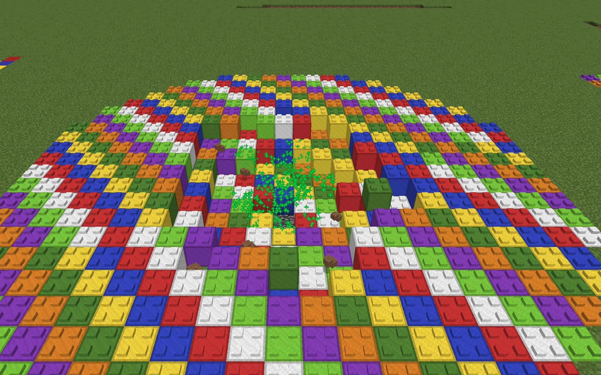
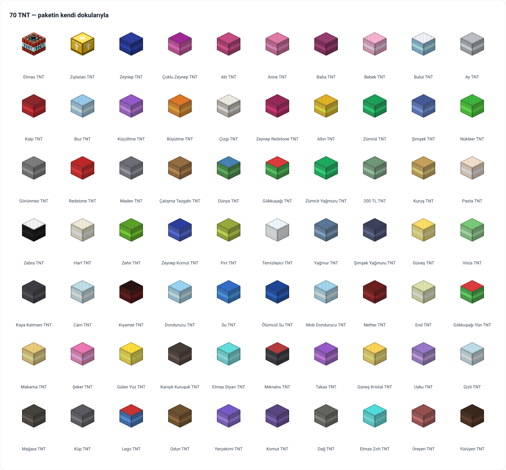

# Super TNT

**Çocuklarımla birlikte yaptığımız Minecraft eklentisi: 70 çeşit TNT, tuzak bloklar, sihirli
eşyalar, dev canavarlar ve girilecek 130'dan fazla kılık. Tablette, Bedrock'ta çalışır.**

[](https://github.com/mmdemirbas/super-tnt-mod/actions/workflows/build.yml)
[](LICENSE)

[Web sitesi](https://mmdemirbas.github.io/super-tnt-mod/) ·
[Kaynak kod](https://github.com/mmdemirbas/super-tnt-mod) ·
[Sürüm notları](bedrock/PORT-DURUMU.md) ·
[Proje sayfası](https://mdemirbas.com/tr/projeler/super-tnt-mod/)



[Oyundan daha fazla kare](https://mmdemirbas.github.io/super-tnt-mod/kareler.html) · hepsi `docs/kareler/`'de.

Fikirler çocuklardan geliyor: "patlayınca etrafa kağıt saçan TNT", "kazınca patlayan kum",
"herkesi minik yapan top". Her biri bir akşam yazılıyor, ertesi gün tablette deneniyor, olmayanı
söylüyorlar. Böyle böyle bir TNT modu, Zeynep TNT'den Kıyamet TNT'ye 70 patlayıcıya, kılık
değiştirmeye ve dev canavarlara büyüdü.

<!-- katalog -->
**v1.51.0 · 70 TNT · 51 blok · 53 eşya · 4 canavar · 135 kılık** — tam liste [katalogda](docs/KATALOG.md).
<!-- /katalog -->



## Kurulum

Paket bir **Bedrock Add-On**'dur (`SuperTNT.mcaddon`); Android tabletlerde ve telefonlarda
Minecraft'a bir dokunuşla eklenir.

```bash
python3 bedrock/build.py       # -> bedrock/out/SuperTNT.mcaddon
./ctl deploy tablet            # derle + bağlı tabletlere gönder (kablosuz)
./ctl deploy tablet zeynep     # yalnız bir çocuğun tableti
./ctl status                   # ne bağlı
```

Elle kurmak için `.mcaddon` dosyasını cihaza kopyalayıp Minecraft ile açın; ardından dünyanın
ayarlarında davranış ve kaynak paketini etkinleştirin. Adım adım:
[web sitesinde](https://mmdemirbas.github.io/super-tnt-mod/#install).

## Nasıl oynanır

- **Tarif:** çoğu TNT aynı kalıbı kullanır — 8 malzeme çevrede, ortada normal TNT.
- **Ateşleme:** çakmak taşı, redstone sinyali ya da yan taraftaki patlama.
- **Komut:** `/give @s stnt:diamond_tnt` gibi; tam liste katalogda.
- **Kılık:** Dönüşüm Asası'yla bir hayvana, canavara ya da bloğa dönüş.

Oyun içi ipuçları her TNT ve eşyanın üzerinde yazar; eşyaların kullanımı ve tablet kısayolları
[web sitesinde](https://mmdemirbas.github.io/super-tnt-mod/#esyalar), tam liste [katalogda](docs/KATALOG.md).

## Depo

| Yol | Ne |
|---|---|
| `bedrock/build.py` | Ürün. TNT, blok, eşya, canavar ve kılık listeleri ve paketi üreten kod. `super_tnt_BP/` ve `super_tnt_RP/` bunun çıktısıdır, elle düzenlenmez. |
| `bedrock/PORT-DURUMU.md` | Sürüm notları; paketin ne yaptığının kaynağı. |
| `bedrock/tools/test.sh` | Tablete göndermeden önce: derleme, paket denetimi, simülasyon, mutasyonlar. |
| `src/` | Modun ilk hali, Fabric (Java) modu. Artık geliştirilmiyor; özellikler yalnız Bedrock'a eklenir. |
| `site/` | Web sitesi; GitHub Pages olduğu gibi yayımlar. |
| `docs/KATALOG.md` | Tam katalog; `scripts/katalog.py` üretir. |
| `docs/emulator.md` | Android emülatöründe Minecraft: `./ctl deploy android` ve `bedrock/tools/shots.sh` ile oyun içi doğrulama ve ekran görüntüsü. |
| `scripts/katalog.py`, `scripts/tnt_duvari.py` | Katalog sayfasını ve yukarıdaki TNT duvarını `build.py` listelerinden üretir. |

## Geliştirme

```bash
bash bedrock/tools/test.sh     # paket + denetim + sim + mutasyonlar, tek komut
python3 scripts/katalog.py     # docs/KATALOG.md ve README özeti
python3 scripts/tnt_duvari.py  # TNT duvarı (docs/tnt-duvari.svg)
./gradlew build                # eski Java modu (build/libs/*.jar)
```

Kurallar `CLAUDE.md`'de: her davranış değişikliği iki dildeki ipucuyla aynı commit'te;
`main`, `zeynep` dalının sıkı atasıdır.

## Lisans

[LICENSE](LICENSE)
