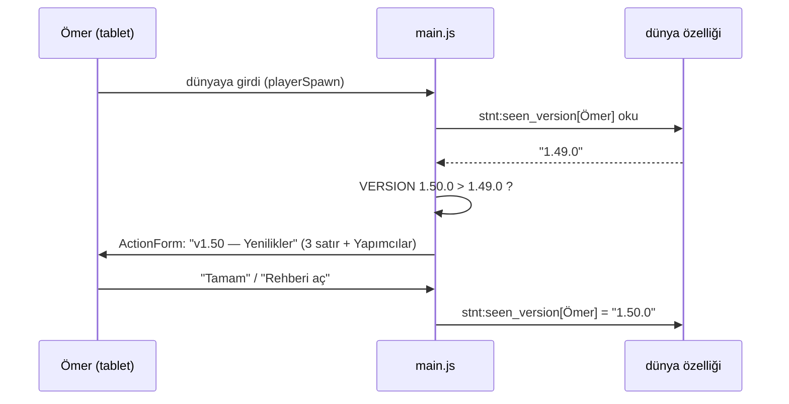

> [!TLDR]
> Sorun yetenek değil: paketin **mantığı** mağaza eklentilerinden geniş, **görünen katmanları** hiç yapılmamış. Ömer'in "eksik" dediği şey sayılabiliyor ve kapatılabiliyor.
>
> - 70 TNT'nin 68'i aynı yüz, 53 eşyanın 31'i kodla çizilmiş sembol, 100 eşya ve bloğun 97'si kraftlanamıyor, güncellemeler sessiz.
> - Üç iş: her şeye kendi yüzü ve animasyon; her şeye tarif + oyun içi rehber; her güncellemede "bak, bu geldi" ekranı.
> - Dört deploy turu. İlk tur küçük ve gösterişli: aynı akşam üç fark birden görünür.
> - Her turda Ömer bir şey çizer ya da seçer. Kendi çizdiği TNT'yi pakette görmesi, hiçbir mağaza eklentisinin veremeyeceği şey.

Bu bir **rehber**, katalog değil: baştan sona okunur, her bölüm bir öncekinin sorusunu açar. Karar listesi ve risk tablosu sonda, başvurmak için.

## Ömer neye bakıp "eksik" diyor? {#kanit}

Bir deploy sonrası tableti alıyor. Yaratıcı menüde Süper TNT sekmesini açıyor: 70 TNT, hepsi aynı yüz, yalnız rengi değişmiş. Yıldırım Büyüsü'nü alıyor: ikon, kodun çizdiği bir şimşek işareti. Survival dünyasına geçip çalışma masasını açıyor: tarif kitabında TNT'ler var, başka hiçbir eşya yok. YouTube'da gördüğü mağaza eklentisinde her şeyin ayrı çizimi, sesi, kitabı vardı. "Bizimki eksik" cümlesi buradan çıkıyor; bir izlenim değil, üç somut gözlem.

```oku-chart
{"type":"stacked-bar","title":"Doku kaynağı — el çizimi mi, kod mu?","categories":["TNT (70)","Eşya (53)","Blok (50)"],"series":[{"label":"el çizimi","color":"success","values":[2,22,8]},{"label":"kodla üretilmiş (şablon rengi, sembol, düz kare)","color":"warn","values":[68,31,42]}]}
```

```oku-chart
{"type":"stacked-bar","title":"Tarif — survival'da elde edilebilir mi?","categories":["TNT (70)","Eşya (53)","Blok (50)"],"series":[{"label":"tarifi var","color":"success","values":[70,2,1]},{"label":"tarifi yok","color":"danger","values":[0,51,49]}]}
```

Sayılar [`bedrock/build.py`](#f/bedrock/build.py) tablolarından ve üretilen paketten okundu (2026-09-14, v1.49.0). "Kodla üretilmiş" TNT dokusu, tek bir şablonun rengini değiştiren `tnt_face`; blok dokusu `decor_texture`'ın düz ya da desenli karesi; eşya ikonu `symbol_texture`'ın kod çizimi.

Grafiklerin göstermediği, ama aynı ilk bakışta fark edilen dört şey:

```oku-table
{"headers":["Yüzey","Bugün","Mağaza eklentisinde"],"rows":[["Özel ses","0 dosya; her eylem vanilla sesle","İmza anların kendi sesi"],["Animasyonlu doku","yok (`flipbook_textures.json` üretilmiyor)","Ateş, portal, sıvı benzeri her şey animasyonlu"],["Oyun içi rehber","yok; ipucu yalnız eşya elde tutulunca","Kitap ya da menü: ne yapar, nasıl yapılır"],["Güncelleme","sessiz; sürüm numarası paket adında","Girişte 'yenilikler' ekranı"],["Paket simgesi","kodun çizdiği TNT yüzü","Özel çizim"]]}
```

```oku-insight
{"b":"Mantık tarafı (70 TNT, 50 blok, 53 eşya, 135 kılık, 168 sim testi) çoğu mağaza eklentisinden geniş. Ömer'in gördüğü katmanlar — doku, ses, tarif, sunum — hiç yapılmamış. Fark yetenek değil, eksik iş."}
```

## Bir inancı ne değiştirir? {#inanc}

İnanç kanıtla besleniyor; her deploy'da aynı üç kanıtı yeniden görüyor. Kanıtı kesen iş, inancı keser. Bir de dördüncü kaldıraç var: kendi elinin izi. Mağaza eklentisinde onun çizdiği bir TNT yok; bizimkinde olabilir.

```mermaid
graph LR
  A["68 TNT aynı yüzde"] --> K(("'eksik, ucuz'"))
  B["97 eşya kraftlanamıyor"] --> K
  C["güncelleme sessiz, fark görünmüyor"] --> K
  K --> I{"'biz yapamayız'"}
  S1["her TNT'ye kendi yüzü,\nateşe animasyon"] -. keser .-> A
  S2["her şeye tarif,\noyun içi rehber"] -. keser .-> B
  S3["girişte 'bak, bu geldi'\nekranı"] -. keser .-> C
  O["Ömer'in çizdiği TNT\npakette"] -. çürütür .-> I
  classDef ev fill:var(--series-3-soft),stroke:var(--series-3),color:var(--text)
  classDef fix fill:var(--series-1-soft),stroke:var(--series-1),color:var(--text)
  classDef own fill:var(--series-2-soft),stroke:var(--series-2),color:var(--text)
  class A,B,C ev
  class S1,S2,S3 fix
  class O own
```

Sıra bu yüzden önemli: en ucuz iş (yenilikler ekranı) tek başına inancı kırmaz ama diğer ikisini **görünür** yapar. Sanat en pahalı iş ama ilk bakışı değiştiren o. Tarif ve rehber "eksik" cümlesinin somut karşılığını siler.

## İş 1 — Sanat: her TNT'nin kendi yüzü {#sanat}

Ömer sekmeyi açtığında 70 farklı yüz görecek: Elmas TNT'nin yan yüzünde elmas, Yıldırım TNT'de şimşek, Zeynep TNT'de pembe kalp. Ender Ateşi ve Altın Ateş kıpırdayacak. Paket simgesi kodun TNT yüzü değil, gerçek bir çizim olacak.

Doku üretimi zaten `build.py` içinde tek bir boru hattı; yapılacak iş kaynağı zenginleştirmek ve araya bir **stil geçidi** koymak. Böylece Ömer'in çizdiği bir doku da, kodun ürettiği de aynı kontur ve gölge kuralından geçip aynı aileye ait görünür.

```mermaid
flowchart LR
  subgraph kaynak["Kaynak"]
    T["şablon TNT yüzü\n(bugünkü)"]
    E["Java'daki el çizimleri\n(22 ikon, 8 blok)"]
    O["Ömer'in çizimleri\n(tablet, 16×16 PNG)"]
    Y["yeni el çizimi\n(piksel ızgarası, kod içinde)"]
  end
  subgraph stil["Stil geçidi (build.py)"]
    K["kontur + 3 ton gölge\n+ parlama"]
    A["amblem bindirme\n(symbol_texture'ın 31 sembolü\nTNT yüzüne)"]
  end
  subgraph cikti["Paket"]
    AT["terrain / item atlas"]
    F["flipbook_textures.json\n(ateş, portal: 4–8 kare)"]
    P["pack_icon.png"]
  end
  T --> A --> K --> AT
  E --> K
  O --> K
  Y --> K
  K --> F
  Y --> P
  classDef src fill:var(--series-2-soft),stroke:var(--series-2),color:var(--text)
  classDef gate fill:var(--series-1-soft),stroke:var(--series-1),color:var(--text)
  classDef out fill:var(--series-4-soft),stroke:var(--series-4),color:var(--text)
  class T,E,O,Y src
  class K,A gate
  class AT,F,P out
```

Üç dalgada, ucuzdan pahalıya. İlk dalga tek akşamda biter ve 70 TNT'nin hepsini değiştirir; çünkü amblemler zaten çizilmiş, yalnız TNT yüzüne bindirilmiyor.

```oku-table
{"headers":["Dalga","Ne değişir","Kaynak","Tahmin","Ömer'in gördüğü"],"rows":[["1 · amblem + animasyon","70 TNT'nin yan yüzüne konuya uygun amblem; Ender/Altın Ateş 6 kare flipbook; yeni paket simgesi","mevcut 31 sembol + yeni 10 amblem, kod","1 akşam","sekmede 70 ayrı yüz; ateş kıpırdıyor; paket listesinde kendi simgemiz"],["2 · en çok kullanılan 20","Ömer'in en sevdiği 20 eşya/TNT'ye gerçek piksel çizimi (gölge, kontur, siluet)","piksel ızgarası kod içinde; 3–5 tanesi Ömer'den","2–3 akşam","elindeki eşya mağazadakinden ayırt edilmiyor"],["3 · kalanlar","31 sembol ikonu ve 42 üretilmiş blok karesi tek tek çizime","aynı yöntem, seri iş","3–4 akşam, tur 3–4'e yayılır","hiçbir yerde düz kare kalmıyor"]]}
```

Doğrulama: [`bedrock/tools/icon_sheet.py`](#f/bedrock/tools/icon_sheet.py) zaten bir kontak levhası üretiyor; her dalgadan önce levhaya bakıp beğenmediğimizi geri çeviririz, tablete öyle gider. `check_pack.py`'ye bir kural: görünür bir blok ya da eşyanın dokusu `decor_texture`/`symbol_texture`'dan geliyorsa **uyarı** (dalga 3 bitince hata). Sim bu katmanı göremez; animasyonun tablette çizildiği ilk turda **tek blokla** doğrulanır.

Dürüst sınırlar: eşya ikonları Bedrock'ta animasyon alamaz (yalnız blok atlası flipbook destekler); eşyaya 3B model vermek attachable ister, bu planda yok; benim piksel çizimim ızgara üzerinden gidiyor, iyi ama bir illüstratörün elinden çıkmış gibi olmaz. En güzel parçaların Ömer'den ya da bir piksel uygulamasından gelmesi bu yüzden yalnız duygusal değil, kalite açısından da doğru.

## İş 2 — Tarif + Rehber: survival'da her şey var {#tarif}

Ömer çalışma masasını açtığında tarif kitabında Lazer Kılıcı'nı görecek, malzemesini toplayıp yapabilecek. Cebinde bir **Süper TNT Rehberi** olacak: sağ tık, kategori seç, eşyaya bas — ne yapar, nasıl yapılır, dikkat edilecek şey. Bugün her ipucu yalnız eşya elde tutulunca görünüyor; eşyayı bulamayan çocuk ipucunu da göremiyor.

Yüz tarif tek tek uydurulmaz; üç kademe ve bir kural yeter. Kural: her tarifin ortasında **imza malzeme** (eşyanın ne yaptığını söyleyen şey), çevresinde kademe malzemesi. Böylece tarif ezberlenmez, tahmin edilir.

```oku-table
{"headers":["Kademe","Çevre malzemesi","Kimler","Örnek"],"rows":[["Kolay","taş, demir külçe, odun, yün","yiyecek, dekor, hayalet bloklar, lego","Acılı Cips: 8 buğday + ortada kırmızı boya"],["Orta","altın külçe, redstone, ender incisi, cam","büyüler, toplar, iksirler, plakalar","Yıldırım Büyüsü: 8 redstone + ortada şimşek çubuğu (yıldırım tuzağı)"],["Zor","elmas, nether yıldızı, ender gözü, netherit","kılıçlar, kara delik, kılık eşyaları, Herobrine çağırıcı","Kara Delik: 8 obsidyen + ortada ender gözü"]]}
```

Rehber, mevcut kılık menüsüyle aynı `ActionFormData` altyapısı (135 kayıtla çalıştığı sim'de ölçülü); yeni bir teknoloji girmiyor. Üç seviye, her seviyede geri tuşu:

```mermaid
flowchart TD
  R["Süper TNT Rehberi\n(eşya, sağ tık)"] --> M["Ana menü\nTNT · Eşya · Blok · Kılık · Yenilikler"]
  M --> L["Liste\n(ikon + ad, 70'e kadar)"]
  L --> D["Detay sayfası"]
  D --> D1["Ne yapar\n(ipucu metni, aynı kaynak)"]
  D --> D2["Nasıl yapılır\n3×3 tarif ızgarası\n(metin olarak çizilir)"]
  D --> D3["Dikkat\n(yakar / öldürür / geri alınmaz)"]
  D --> D4["'Ver' düğmesi\n(yaratıcı modda)"]
  classDef ui fill:var(--series-1-soft),stroke:var(--series-1),color:var(--text)
  class R,M,L,D,D1,D2,D3,D4 ui
```

Doğrulama, üç katmanda: `check_pack.py`'ye "görünür her eşya ve bloğun tarifi var, malzemeleri gerçek" kuralı; sim'de rehberin her sayfasının hatasız açıldığı ve detayın ipucuyla aynı metni gösterdiği senaryo; tablette tarif kitabında **görünüp görünmediği** — Bedrock 1.20.30'dan beri tariflerin `unlock` alanı var ve özel tarifin kitapta ne zaman belirdiği burada çalıştırılmadan bilinemez. Bu ilk turda tek tarifle sınanır.

## İş 3 — Yenilikler ekranı: ilerleme görünür {#yenilikler}

Ömer güncellemeden sonra dünyaya girdiğinde bir ekran açılacak: "Süper TNT v1.50 — Yenilikler", altında üç satır, her satırda ikon ve bir cümle, en altta "Yapımcılar: Ömer ve Baba". Bir daha görmeyecek; bir sonraki sürümde yenisi gelecek. En küçük iş bu, ama diğer ikisini görünür yapan o.



Notlar `build.py`'de `VERSION`'ın hemen yanında bir `CHANGES` tablosunda durur; sürümü artıran commit notunu da yazar, `check_pack.py` "bu sürümün notu yok" diye durdurur. Aynı tablo Rehber'in "Yenilikler" sayfasını ve `PORT-DURUMU.md`'nin başlığını besler; üç yer, tek kaynak. Sim senaryosu: eski sürümle giren oyuncuya ekran açılır, aynı sürümle girene açılmaz, ilk girişte (`initialSpawn`) hoş geldin ekranıyla çakışmaz.

## Hangi sırayla, hangi ritimle? {#sira}

Tur = bir deploy = tablette bir dokunuş. Her turun kuralı: Ömer'in **o akşam** fark edeceği en az bir şey. İlk tur bilerek küçük ve gösterişli; dördüncü tur cila.

```oku-chart
{"type":"gantt","title":"Dört tur (akşam sayısı)","tasks":[{"label":"Tur 1 · yenilikler ekranı + 70 amblem + ateş animasyonu + paket simgesi","start":0,"end":2,"color":"accent"},{"label":"Tur 2 · en sevilen 20 çizim + 50 tarif + Ömer'in 3 dokusu","start":2,"end":6,"color":"success"},{"label":"Tur 3 · Rehber + kalan 50 tarif + blok dokuları","start":6,"end":10,"color":"success"},{"label":"Tur 4 · kalan ikonlar + sesler + cila","start":10,"end":14,"color":"warn"}]}
```

```oku-step-flow
{"steps":[{"t":"Tur 1 — 'bu farklı'","meta":"1–2 akşam · risk: flipbook tablette çizilmezse tek blokla anlaşılır","b":"Girişte Yenilikler ekranı. Sekmede 70 ayrı TNT yüzü. Ender Ateşi kıpırdıyor. Paket listesinde kendi simgemiz. Ömer bu turda **en sevdiği 20 eşyayı** seçer; ikinci turun listesi budur."},{"t":"Tur 2 — 'bu bizim mi?'","meta":"3–4 akşam · Ömer 3 doku çizer","b":"Seçtiği 20 eşya gerçek çizim. Elli tarif; survival'da masa dolu. Yenilikler ekranında 'Dokular: Ömer' satırı."},{"t":"Tur 3 — 'her şey var'","meta":"3–4 akşam","b":"Cepte Rehber. Kalan tarifler. Düz kare blok kalmıyor. Ömer rehber metinlerini kendi diliyle düzeltir."},{"t":"Tur 4 — 'mağazadaki gibi'","meta":"3–4 akşam · sesler dış kaynak ister","b":"Kalan ikonlar. İmza anlara özel ses (bkz. kararlar). Kontak levhasında beğenilmeyen ne varsa yeniden."}]}
```

**Öneri:** Tur 1'e bu hafta başlamak. Gerekçe: en düşük maliyetle en çok yüzeyi değiştiriyor, üç işin altyapısını (stil geçidi, CHANGES tablosu, tarif üreteci) kuruyor ve Ömer'e ilk turda bir görev veriyor. Sanata baştan tam dalmak, ilk görünür sonucu iki haftaya atardı.

## Ömer ne yapar? {#omer}

İnancı değiştiren şey paketin iyi olması değil, paketin iyi olmasında **payı** olması. Görevler küçük, gerçek ve pakette görünür; "yardım ediyor" oyunu değil.

```oku-table
{"headers":["Tur","Görevi","Nasıl","Pakette nerede görünür"],"rows":[["1","En sevdiği 20 eşyayı seçmek","Sekmeyi gezip liste yapar; sıralama onun","Tur 2'nin çizim listesi = onun listesi"],["1","Her amblemi onaylamak","Kontak levhası tablette; beğenmediğini işaretler","Beğenmediği amblem tablete gitmez"],["2","3 doku çizmek","Tablette piksel uygulaması (Pixel Studio / Dotpict), 16×16, PNG; stil geçidi gerisini yapar","Kendi TNT'si sekmede; Yenilikler ekranında adı"],["3","Rehber metinlerini düzeltmek","Sayfaları okur, 'çocuk böyle demez' dediği yeri değiştiririz","Rehberde onun cümleleri"],["her tur","10 dakikalık test listesi","Deploy sonrası 5 madde: ateş, tarif, rehber, ekran, ses","Bulduğu her hata commit mesajında 'Ömer buldu'"],["her tur","Yapımcılar satırı","—","Yenilikler ekranının altında 'Ömer ve Baba'"]]}
```

Tersi de geçerli: bir görev onun seçmediği, görmediği bir şeyse "katkı" değil ödevdir. Bu yüzden ilk görev seçim, çizim değil.

## Neye karar vermeliyiz? {#kararlar}

Sanatın nereden geleceği planın en büyük değişkeni; üç yol, ikisi birlikte önerilir.

```oku-compare-grid
{"cards":[{"t":"Kod içinde piksel ızgarası (ben)","verdict":"good","accent":"success","b":"Ender Çakmağı ikonu böyle çizildi: 16 satırlık metin ızgarası, `build.py` içinde, sürüm kontrolünde. **Hızlı ve tutarlı**; stil geçidi gölgeyi verir. Sınır: ızgara çizimi iyi ama illüstratör eli değil. Dalga 1 ve 3 için doğru yol."},{"t":"Ömer + piksel uygulaması","verdict":"good","accent":"accent","b":"Tablette 16×16 çizer, PNG olarak `bedrock/custom/` altına girer, stil geçidi kontur ve gölgeyi ekler. **En anlamlısı**; yavaş ve düzensiz. 3–5 parça için doğru yol — hepsi için değil, hevesi öldürür."},{"t":"Hazır / üretken görsel","verdict":"warn","accent":"warn","b":"Hızlı ve parlak. İki sorun: 'bizim değil' hissi tam da kırmaya çalıştığımız şey; lisans ve stil tutarsızlığı. Yalnız paket simgesi için referans olarak, doğrudan pakete girmeden."}]}
```

Kalan kararlar küçük ama sırayı etkiliyor:

```oku-table
{"headers":["Karar","Seçenekler","Etkisi","Önerim"],"rows":[["Survival oynanıyor mu?","evet / hayır / bazen","Tarif işinin önceliği; hayırsa Rehber öne, tarifler tur 4'e","Tarifleri yine yapmak — 'kraftlanamıyor' cümlesi survival oynanmasa da kurulur"],["Rehber dili","yalnız TR / TR+EN","EN metin yükü ikiye katlar","Yalnız TR; paket iki dilli kalır ama rehber Ömer için"],["Yapımcılar satırı","var / yok; isimler","Katkı kaldıracının görünür yüzü","Var: 'Ömer ve Baba'; Zeynep'in paketinde 'Zeynep ve Baba'"],["Ses kaynağı","vanilla kombinasyonu / kendi kaydımız (telefon) / hazır kütüphane (CC0)","Tur 4'ün kapsamı","Önce vanilla kombinasyonu; 3–5 imza an için CC0 kütüphane; Ömer bir sesi kendi kaydeder"],["Java jar'ı","kalsın / silinsin","Yalnız depo temizliği","Kalsın, dokunulmaz; CLAUDE.md zaten 'legacy' diyor"]]}
```

## Riskler ve doğrulama {#riskler}

Sim ve statik denetim mantığı görür, görüntüyü görmez. Bu planın işleri tam da görüntü olduğu için her turun kapısı üç parçalı: `bash bedrock/tools/test.sh` (bugünkü dört katman), kontak levhası (gözle), tablette 10 dakikalık liste (Ömer'le).

```oku-table
{"headers":["Risk","Nasıl anlarız","Önlem"],"rows":[["Flipbook tablette çizilmiyor ya da atlası bozuyor","Tur 1'de Ender Ateşi sabit ya da mor-siyah","Tur 1'de yalnız iki ateş animasyonlu; başarısızsa `flipbook_textures.json` üretimi kapatılır, sabit dokuya döner"],["Özel tarif tarif kitabında görünmüyor (`unlock`)","Tablette masa açılınca yalnız TNT'ler","Tur 1'de tek tarifle (Altın Flint zaten var) doğrulanır; gerekiyorsa `unlock: always_unlocked` eklenir"],["Amblem bindirme TNT yazısını bozuyor","Kontak levhasında okunmayan yüz","Amblem yalnız yan yüzün orta 8×8'ine; levhada Ömer onayı"],["Atlas büyüyünce paket şişer","`test.sh` boyut satırı","Bugün 402 KB, sınır ~10 MB; 250 doku ×1 KB = fark yok"],["Rehber 170 kayıtla yavaş açılıyor","Sim'de form kayıt sayısı; tablette açılış süresi","Kılık menüsü 135 kayıtla ölçülü; liste sayfalanır (30'ar)"],["Ömer beğenmiyor","Söyler","Seçen o: liste onun, amblem onayı onun; beğenilmeyen tablete gitmez"],["Yenilikler ekranı her girişte açılıyor (sürüm yazılmıyor)","Sim senaryosu: ikinci giriş","Senaryo ve mutasyon: yazma satırı silinince test düşmeli"]]}
```

## SSS {#sss}

**Neden önce sanat, yeni özellik değil?** Yeni özellik "eksik" listesine bir kalem daha ekler; Ömer onu da aynı yüzle, tarifsiz görür. Var olan 170 şeyin görünüşü değişince eklenti "bitmiş" görünür, o zaman yeni özellik bir sürpriz olur.

**Mağaza eklentileri neden iyi görünüyor?** Sanat, ses ve sunuma harcanan zaman; mantıkları çoğunlukla bizimkinden dar. Onlar aylarca bir ekip; biz akşamları iki kişi. Fark kapatılabilir çünkü bizde mantık bitmiş, geriye yüzey kalmış.

**Java'ya ne olacak?** Bakım dışı, depoda kalır. Oradaki üç özellik Bedrock'a taşındı; bir daha oraya yazmıyoruz (CLAUDE.md böyle diyor).

**Dört tur bitince "bitmiş" mi olacak?** Hayır; bir eklenti hiç bitmez. Ama "eksik" hissi, bakılan yerde boşluk görmekten gelir. Dört tur bakılan her yeri kapatır: sekme, el, masa, cep, giriş ekranı. Sonrası yeni özellik, yeni sürpriz.

**Zeynep'in paketi?** Aynı `build.py`, aynı işler; Yapımcılar satırı ve çizim görevleri paket başına ayrılır. Ayrı bir plan gerekmez.
